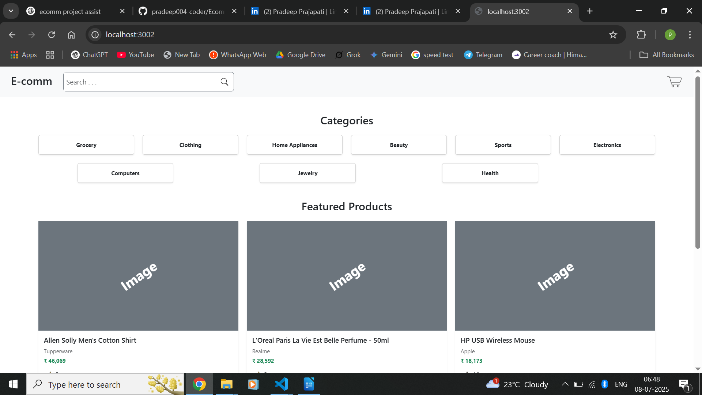
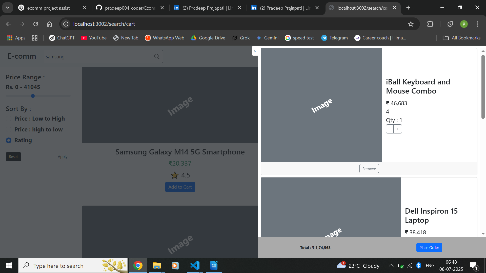
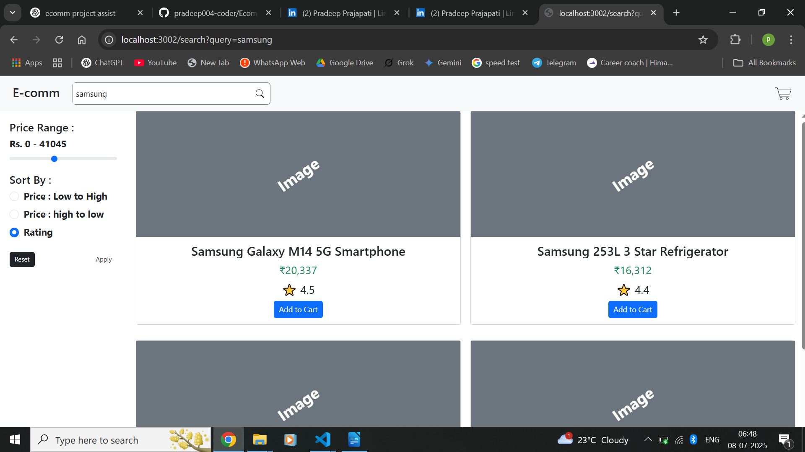
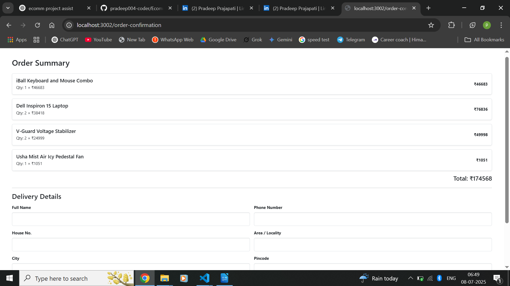

Absolutely! Here's the updated **`README.md`** with **"Buy Now" and "Place Order"** features clearly mentioned in the features section and explained in the usage flow:

---

```markdown
# 🛒 React E-Commerce Store

A functional, responsive, and stylish e-commerce web application built with **React**, **Bootstrap**, and **React Router**. Users can browse products, filter and sort items, view product details, manage their cart, and place orders with ease.

---

## 🚀 Features

- ✅ **Home Page** with category and featured product sections
- 🔍 **Search and Filter Panel** (by category, price, rating, etc.)
- 📦 **Product Detail Page** with rich info
- 🛒 **Add to Cart** with quantity control
- ⚡ **Buy Now** – quickly checkout a single item
- 📋 **Place Order** – order multiple items from cart
- 🧾 **Order Confirmation Page** – with address and payment form
- 🗂️ **Global State Management** via Context API
- 📱 **Fully Responsive UI** for mobile and desktop

---

## 💳 Order Flow

- **Buy Now**:  
  Navigate directly from a product card to the order page with quantity 1 and minimal steps.

- **Place Order**:  
  Add items to the cart → Go to cart → Review quantity → Click *Place Order* → Fill address & payment info.

---

## 📸 Screenshots

### 🏠 Home Page


---

### 🛒 Cart Page


---

### 🔎 Search Page


---

### 🧾 Order Confirmation Page
,(./screenshots/order 2nd half.png)

---

## 🛠️ Tech Stack

- ⚛️ React
- 💅 Bootstrap 5
- 🔁 React Router DOM
- 🧠 Context API
- 🎨 Custom CSS (with utility classes)

---

## 📂 Folder Structure

src/
├── Components/
│   ├── Navbar.js
│   ├── Cart.js
│   ├── ProductDetail.js
│   ├── OrderConfirmation.js
│   └── ...
├── Context/
│   └── ProductContext.js
├── data/
│   └── productData.json
├── App.js
└── index.js


---

## 💻 Getting Started

### 1. Clone the Repository

git clone https://github.com/pradeep004-coder/Ecommerce-Project.git
cd react-ecommerce-store


### 2. Install Dependencies

npm install


### 3. Run Locally

npm start
App runs at: `http://localhost:3000`

---

## 🔐 Order Page Details

On the **Order Confirmation Page**, users are asked to:

* Fill in address: House No., Area/Locality, City, Pincode
* Choose payment method: UPI / Card / COD
* Enter payment details based on method

---

## 📦 Sample Product Format

json
{
  "index": 1,
  "name": "boAt Rockerz 255 Pro+ Neckband",
  "image": "https://example.com/images/product_1.jpg",
  "description": "Compact form factor with powerful sound.",
  "price": 26297,
  "category": "Electronics",
  "brand": "boAt",
  "rating": 4.2,
  "stock": 122
}

---

## ✨ Future Improvements

* [ ] Authentication (Login/Register)
* [ ] Order history and tracking
* [ ] Backend/API integration

---

## 💬 Feedback

For suggestions or issues, please [create an issue](https://github.com/pradeep004-coder/Ecommerce-Project/issues) or connect via [LinkedIn](https://www.linkedin.com/in/pradeep-prajapati-).

---